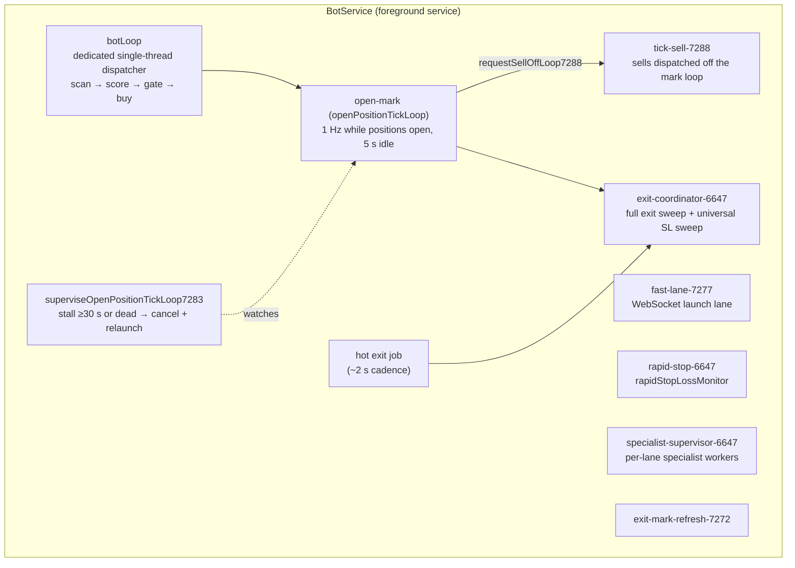
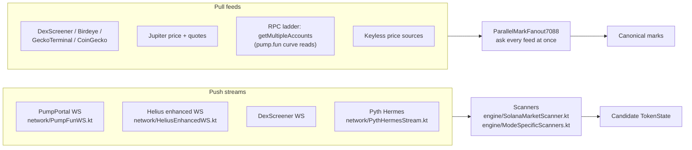
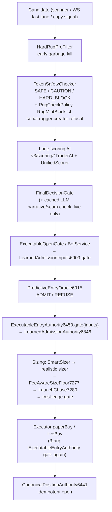
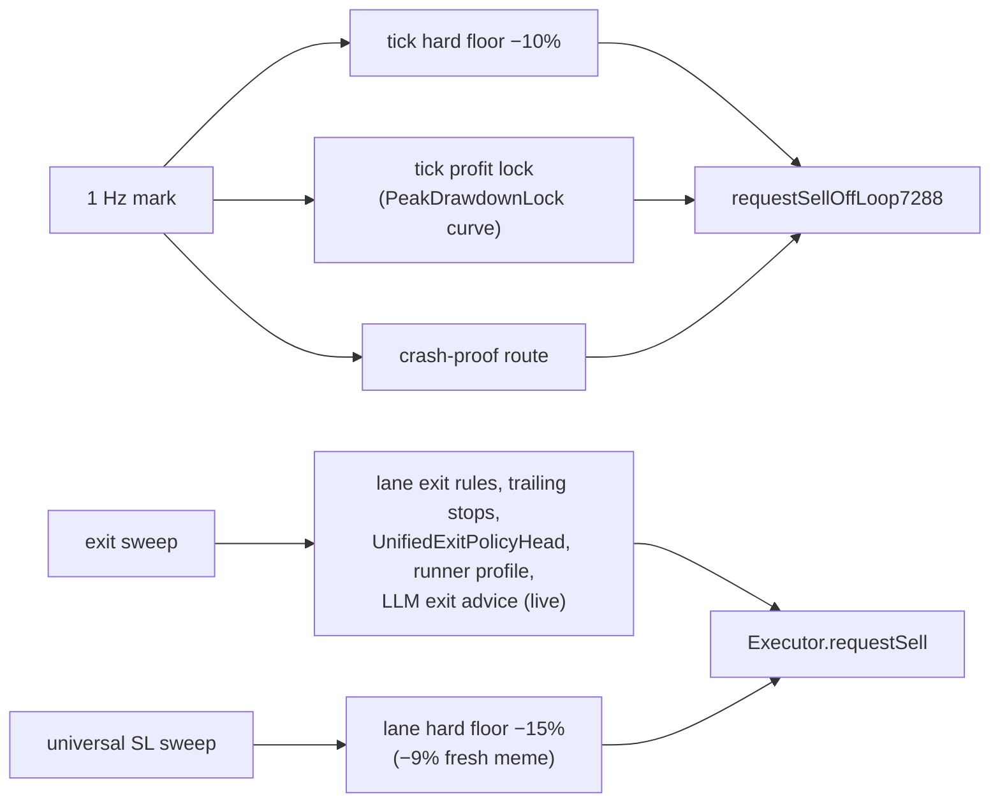

# AATE Architecture

**AATE — Autonomous Algorithmic Trading Engine** · version **5.0.7288** (September 2026)

AATE is a native Android app (Kotlin, minSdk 26, targetSdk 34) that runs a whole trading engine on the phone. It finds candidates, filters them for safety, scores them, decides whether to trade, sizes the order, executes it, manages the exit and learns from the result, all on-device. It is Solana-first. The repository and package name is `com.lifecyclebot`. "LifecycleBot" is the repo name only, not the product name.

This document describes the system as the code stands at 5.0.7288. Source paths are relative to `app/src/main/kotlin/com/lifecyclebot/` unless stated otherwise. Class names that end in a number (for example `PredictiveEntryOracle6915`) carry the build that introduced them. That is a project convention, not a version mismatch.

> Trading crypto is high risk. Paper results are not live results. Nothing here is financial advice.

---

## 1. Scale at a glance (measured from source, 5.0.7288)

| Item | Value |
|---|---|
| Production Kotlin files | 1,200 (≈457,000 lines) |
| Unit-test files / `@Test` cases | 339 files (≈47,000 lines) / 2,699 |
| Custom CI static validators | 16 (run before Gradle in `.github/workflows/build.yml`) |
| Screens (Activities) | 22, plus the settings bottom sheet |
| Traders registered in one engine | 16 (`engine/EnabledTraderAuthority.kt`) |
| `engine/truth/` authority and invariant objects | 368 files |

## 2. Package map

| Package | Files | Role |
|---|---|---|
| `engine/` | 494 top-level (945 incl. subpackages) | Service, executor, gates, learners, exits, LLM, forensics |
| `engine/truth/` | 368 | Single-authority ledgers, invariants, oracle, admission, telemetry |
| `engine/sell/` | — | Sell intent, close lease, balance proof, sell finality |
| `engine/execution/` | — | Route engine, route validation, forensic export, recovery loop |
| `engine/lab/` | 5 | LLM Lab (LLM-invented strategies on a synthetic bankroll) |
| `engine/learning/` | — | Lane exit tuner, entry floor tuner, exploration budget |
| `engine/quant/` | 4 | EV calculator, portfolio analytics, quant metrics |
| `engine/voice/` | 7 | Persona voice (ElevenLabs), SFX |
| `v3/` | 82 | V3 engine: scoring layers (`v3/scoring/`), decision, eligibility, risk, arb |
| `v4/meta/` | 12 | Cross-market meta models (regime, lead-lag, narrative flow, portfolio heat) |
| `perps/` | 68 | Crypto alts, tokenized stocks, commodities, metals, forex, perps |
| `network/` | 37 | Helius, PumpPortal, Jupiter, DexScreener, Birdeye, Pyth, LLM clients |
| `collective/` | 6 | Turso/libSQL collective learning ("hive mind") |
| `ml/` | 1 | On-device ML engine |
| `data/` | 5 | `BotConfig`, models, canonical mint, sentiment data |
| `ui/` | 38 | Activities, view model, custom views, motion kit |

## 3. Process model

The engine lives in one foreground service, `engine/BotService.kt` (≈33,000 lines), declared with `foregroundServiceType="dataSync|specialUse"`. Activities observe it through `ui/BotViewModel.kt`. They never own trading state.

Inside the service, work runs as supervised coroutines on separate dispatchers. A stuck loop cannot starve the loops that protect open capital.

Named coroutines found in `engine/BotService.kt` include `open-mark-6647`, `open-mark-7283`, `tick-sell-7288`, `rapid-stop-6647`, `exit-coordinator-6647`, `exit-policy-6647`, `exit-mark-refresh-7272`, `fast-lane-7277`, `specialist-supervisor-6647`, `service-bootstrap-6516` and `canonical-bootstrap-6515`.

### 3.1 The 1 Hz mark loop and its supervisor

`openPositionTickLoop(gen)` prices every open position once a second, or every 5 s when nothing is open. Each tick runs the fast-path exits: the tick hard floor (`TICK_HARD_FLOOR_PCT = -10.0`), the tick profit lock and the crash-proof route. Every iteration is counted (`OPEN_POS_LOOP_TICK_6983`), including the ones that produced no marks, so cadence is measured rather than inferred.

`superviseOpenPositionTickLoop7283` runs once per bot cycle. If the current iteration has been in flight for 30 s or more, or the job is no longer active, it records the phase and thread frames in `engine/truth/ExitSweepTiming7264.kt`. It then cancels the job and relaunches it under a new generation number, at most once every 60 s. A superseded generation exits on its next check and cannot write. Since 5.0.7288, stall detection matches iteration **sequence numbers** (start sequence against end sequence), not wall-clock gaps.

### 3.2 Sells off the mark loop (5.0.7288)

The three sells the mark loop can issue (crash-proof route, tick hard floor, tick profit lock) go through `requestSellOffLoop7288`. That function launches `executor.requestSell` on the IO pool with one sell in flight per mint. A sell still pending after 60 s may be requested again. A hung sell can no longer freeze pricing for the rest of the book.

### 3.3 Exit coordinator and universal stop-loss sweep

A coordinator runs two kinds of sweep:

- a **full exit sweep**, which evaluates every exit rule per position;
- a **universal SL sweep**, a safety net that applies stop-losses to every position whatever lane owns it. Leases for it are held in `engine/truth/UniversalSlLeaseRegistry6402.kt` and `engine/truth/UniversalSlSentinel6504.kt`.

Both are single-flight and are coalesced through pending flags. Sweep durations, slow positions and stall phases are recorded in `ExitSweepTiming7264`, which is read-only telemetry that no gate reads.

## 4. Data ingestion

- **Launch and trade streams.** PumpPortal WebSocket (launches, migrations and a keyed trade stream; the key is set in Settings since 7284). Helius enhanced WebSocket for tracked wallets. Since 7279 the mint is proved from the pump.fun create event (`network/PumpCurveKeys7269.kt`).
- **Marks.** `network/ParallelMarkFanout7088.kt` queries feeds in parallel and trusts the ones that agree. Bonding-curve prices are read directly from pump.fun curve accounts in batched `getMultipleAccounts` calls over a six-rung RPC ladder. A rung already in backoff is skipped without a request (7281).
- **RPC ladder order.** `engine/RuntimeProviderAuthority6685.kt` puts the configured, authenticated Helius endpoint ahead of a saved public endpoint (7277). The public Solana RPCs come after it.
- **Other sources** include Birdeye, GeckoTerminal, CoinGecko, Jupiter, Pyth, DefiLlama, CEX tickers, RugCheck, Solscan, GMGN, market-data providers for stocks and FX, Fear & Greed, and Telegram/X scrapers (`network/TelegramScraper.kt`, `network/XScraper.kt`). Across all traders there are more than 40 sources.
- **Provider protection.** `network/HostCircuitInterceptor.kt` sits on the shared OkHttp client and enforces per-provider circuit breaking and quota stops. `engine/HealthAwareHttp.kt` and `network/NetworkRetry.kt` add exponential backoff.

## 5. Decision pipeline

Every candidate takes the same path. Each stage can refuse, and every refusal is counted by reason in `PipelineHealthCollector`.

1. **Candidate intake.** Scanners and the WebSocket fast lane produce `TokenState` candidates. Copy-trade signals come from `engine/CopyTradeEngine.kt` and wallets mined by `engine/SmartMoneyDiscovery7277.kt`.
2. **Safety.** `engine/HardRugPreFilter.kt` removes obvious rug profiles before any scoring. `engine/TokenSafetyChecker.kt` assigns a `SafetyTier` (SAFE, CAUTION or HARD_BLOCK). `engine/RugCheckPolicy.kt`, `engine/RugMintBlacklist.kt` and `engine/truth/FreezeAuthorityHardBlock7238.kt` enforce recorded facts.
3. **Lane AI.** Each lane has its own scorer in `v3/scoring/` (see `docs/AI_LAYERS.md`).
4. **FinalDecisionGate** (`engine/FinalDecisionGate.kt`) is evaluated per lane in `BotService` and its verdict is recorded with `ExecutableOpenGate.recordFdg`. The gate does no provider I/O. In live mode it reads cached LLM narrative and scam analysis (`engine/AsyncGeminiNarrativeCache6478.kt`), and a cached scam verdict is a HARD block.
5. **Oracle.** `engine/truth/LearnedAdmissionInputs6909.kt` assembles the learned signals and calls `PredictiveEntryOracle6915.evaluate`. The result is a binary ADMIT or REFUSE plus expectancy, win probability and confidence.
6. **Admission.** `ExecutableEntryAuthority6450.gate(inputs)` delegates to `LearnedAdmissionAuthority6846`. A recorded safety fact or a policy-head HARD_BLOCK refuses in every tier. Once `OracleEdgeProof7263` reads PROVEN, the oracle's verdict *is* the admission decision.
7. **Sizing.** Size is bounded by what can be exited: liquidity, curve depth, wallet and spendable cash. It must clear a fee-aware floor, and a spike chase is cut to the minimum (§7).
8. **Execution.** `engine/Executor.kt` runs `paperBuy` or the live route. It calls the three-argument `ExecutableEntryAuthority6450.gate(lane, mint, sol)` again, which applies loss-streak and cooldown size shaping, and then commits atomically.

## 6. Single-authority ledgers

The main structural rule: **one writer per economic fact.** Mirrors are read-only.

| Authority | File | Owns |
|---|---|---|
| Positions and cash | `engine/truth/CanonicalPositionAuthority6441.kt` | Every position (keyed `mint#runId`), lifecycle `PENDING_ENTRY → OPEN → PARTIALLY_CLOSED → CLOSED / QUARANTINED`, raw `BigInteger` quantities, cost basis. Every mutation runs under one lock and needs an idempotency key. |
| Capital view | `engine/truth/CanonicalCapitalAuthority6450.kt` | Cash, reserved, open cost, open market value, unrealized, realized, fees, total equity. Invariant: `start + realized − fees ≈ cash + reserved + openCost`. |
| Finalized trades | `engine/truth/CanonicalTradeFinalizedBus6450.kt` | The single close event every learner, streak counter and oracle grader subscribes to. |
| Lane identity | `engine/truth/CanonicalLaneIdentity6506.kt` | The one alias table (for example `BLUE_CHIP → BLUECHIP`). A CI scan fails the build if a second copy appears. |
| Enabled traders | `engine/EnabledTraderAuthority.kt` | The atomic set of the 16 traders that are enabled right now. |
| Entry gate | `engine/truth/ExecutableEntryAuthority6450.kt` | The single gate before capital reservation. No lane or source alias bypasses it. |

## 7. Sizing

- `engine/SmartSizer.kt` produces the base ladder. Lane and learner multipliers shape it.
- `Executor.realisticEntrySize6867` runs in both paper and live. It applies wallet-percent, liquidity-impact and spendable caps. Since 7280 its binding cap per mint also bounds the paper ticket that follows.
- `engine/truth/FeeAwareSizeFloor7277.kt` sets the smallest notional at which the fixed round-trip cost (0.00161 SOL) is at most 1.5% of the position. That is ≈0.107 SOL, rounded up to a whole lamport (7281).
- `engine/truth/LaunchChase7280.kt`: a first ticket paying 3× or more over the create price inside the first 180 s is sized at the floor.
- Cost-edge gate (`COST_EDGE_MARGIN_7162 = 1.15` in `engine/Executor.kt`): the forecast edge must clear the modeled cost with margin.

## 8. Exits

- **Profit lock that slides to the peak** (`engine/PeakDrawdownLock.kt`, 7282). The share of the peak the lock may give back *shrinks* as the peak grows: 40% below +50%, 30% at +100%, 18% at +300%, 12% at +1,000%, with a floor of 8% at +3,000% and above. No lane-learned multiplier may push it above 40%.
- **Runner profile** (`engine/RunnerExitProfile7277.kt`). On runner lanes (moonshot, shitcoin, express, sniper, dip hunter, copy and others), give-back locks do not arm until the peak reaches +50%. The exit tuner may not pull take-profit below neutral. A position at −20% inside its first 2 minutes is cut on the first strike.
- **Trailing stops** (`engine/TrailingStopManager.kt`) adapt to profit level, volatility, mode and hold time.
- **Learned exit policy** (`engine/UnifiedExitPolicyHead.kt`, per lane) and the closed-loop take-profit/stop-loss tuner (`engine/learning/LaneExitTuner.kt`).
- **Hard floors.** −10% at tick time, and the lane hard floor of −15% (−9% for fresh memes) in the slower sweep path.
- **Sell machinery** (`engine/sell/`): close leases, sell-amount authority, balance proof after a live sell, and PumpPortal fallback.

## 9. Execution (Solana)

- **Swap build:** Jupiter (`network/JupiterApi.kt`).
- **Submission:** `network/SolanaWallet.kt` tries Helius Sender first (`network/HeliusSender.kt`, SWQOS endpoint), with the tip transfer added by `network/HeliusSenderEnvelope7250.kt`. On a miss it rotates to a Jito bundle (dynamic tip from `network/JitoTipFetcher.kt`), then to the public RPC ladder.
- **pump.fun fallback:** `network/PumpFunDirectApi.kt` builds buy and sell transactions via PumpPortal `trade-local`. This is the final route when Jupiter cannot sell a pump.fun mint.
- **Modes:** `ExecMode { PAPER, LIVE, SHADOW }` (`engine/ExecMode.kt`). In paper, every trader runs so the engine can learn. In live, only operator-enabled traders run, stocks and forex are quarantined, and non-meme live execution is staged. Treat the engine as paper-first.
- **Live safety:** `engine/LiveSafetyCircuitBreaker.kt` refuses live trading below 0.10 SOL and halts on a 10% session drawdown.
- **App fee:** 0.5% per spot side, 1% for leverage (`engine/Executor.kt` constants).

## 10. Persistence

| Store | Where | Holds |
|---|---|---|
| SQLite `trade_history.db` | `engine/TradeHistoryStore.kt` | The trade journal (every buy and sell, paper and live), kept until the user clears it. The oracle reads up to 5,000 terminal rows from it. |
| SharedPreferences | many objects | Learner weights, oracle edge-proof tallies (`aate_oracle_edge_proof_7287`), counters, UI state |
| EncryptedSharedPreferences (AES-256) | `data/BotConfig.kt`, `engine/TreasuryManager.kt`, `engine/MultiChainWalletVault6546.kt` | Keys and secrets |
| Turso / libSQL | `collective/TursoClient.kt`, `collective/CollectiveSchema.kt` | Collective patterns, token blacklist, mode performance, whale effectiveness, hive messages |
| Finality replay | `engine/truth/CanonicalFinalityPersistence6486.kt` | Closes replayed at startup, so graders subscribed early still see them |

## 11. LLM council

`engine/GeminiCopilot.kt` holds a provider council: Gemini (`gemini-2.5-flash`), Groq (`openai/gpt-oss-20b` primary, via `engine/GroqRouteConfig6498.kt`), Cerebras (`openai/gpt-oss-120b`), Mistral, OpenRouter, OpenAI-compatible endpoints and an Emergent proxy. Keyless fallbacks are in `network/KeylessLlmClient.kt` and `network/KeylessLlmProviders6999.kt`. Calls are spaced (≥1.25 s), cached (3 min) and backed off per provider.

LLM calls stay off the hot path. Narrative and scam analysis is fetched in the background and cached for 10 minutes (`AsyncGeminiNarrativeCache6478`). In live mode, FinalDecisionGate reads that cache and a cached scam verdict hard-blocks. Exit advice (`AsyncGeminiExitAdviceCache6479`) can trigger an exit in live mode for positions up at least 15%. Other uses: sentiment (`engine/LlmSentimentEngine.kt`), bounded parameter tuning (`engine/LlmParameterTuner.kt`), chat personas and voice, and the LLM Lab.

## 12. Forensics and health

- `engine/ForensicLogger.kt` writes structured phase lines (`🧬[PHASE] #seq SYMBOL k=v …`) at INFO level so they survive log export.
- `engine/PipelineHealthCollector.kt` keeps funnel counters, a labelled counter for every refusal reason, a main-thread ANR watchdog (250 ms ping, samples the stack while blocked) and a ring buffer of forensic events. It backs the Pipeline Health screen.

## 13. UI layer

There are 22 Activities in `ui/`, including Main, Wallet, Journal, Live Trade Log, Pipeline Health, Universe Health, Crypto Alt, Multi-Asset, Lab, Collective Brain, Insider Wallets, Tuning, Backtest, Persona Studio and Security (biometric lock), plus `ui/SettingsBottomSheet.kt`. The visual system is a dark navy terminal: colors are defined in `app/src/main/res/values/colors.xml` and a CI palette-drift guard keeps them in sync. Screens read snapshots from the canonical authorities and never write economic state.

## 14. Build and CI

`.github/workflows/build.yml` runs 16 Python validators from `ci/` as hard gates before `./gradlew assembleRelease`. The unit suite (`testReleaseUnitTest`) runs after assembly with `continue-on-error: true`: its results are uploaded but do not block the APK. `.github/workflows/runtime-test.yml` boots an Android emulator and runs a runtime smoke test (`ci/runtime-test.sh` at the repository root). See `TECHNICAL_DESCRIPTION.md` §9.
